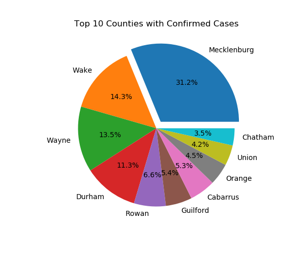
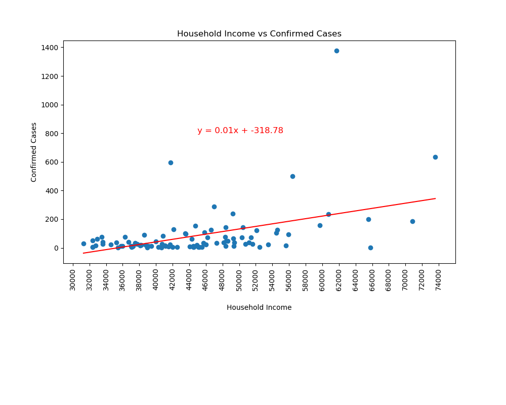

# Project: NC Census Data vs COVID-19 Analysis

For this project we used the census data to establish a correlation with demographics and COVID-19 data.  The goals of the project were the following:
* Identify the top 10 counties that were affected with COVID-19
* Understand correlation between the following:
    * Populaton VS Confirmed Cases
    * Median Age VS Confirmed Cases
    * Median Age VS Death
    * Household Income VS Confirmed Cases
* Develop Heatmap for Confirmed & Death cases in North Carolina by county

# Implementation Approach
As a team we researched several sources of data with many of our initial attempts hitting road blocks:
* Zillo Housing data - Received 500 error from API 
* Google API Bank data - 20 results Google limitation
* Census API data - Extensive research with multiple possibilities; i.e. API's, Restful API's, zipcodes, etc.
* COVID-19 data was retrieved using public access to COVID-19 data
We obtained the data from the selected data sources, and merged the data on zipcode using pandas data frame.  From there we generated plots, determined correlation coefficients, analyzed the data based on the hypothesis.

## Top 10 Effected Counties
The top 10 counties allowed us to take a look at the worst affected areas of the state.  Although it was easy to predict that the Charlotte area would be the hardest hit, it was still a surprise to see how big a total percentage that it made up.

## Head Map of Death Cases By County
The use of a heatmap allowed us to illustrate how almost every area of North Carolina has experienced death caused by COVID-19.  It also points out in a more impressionable way the areas worst affected by the virus.

## Correlation between Population and Confirmed Cases
The correlation betwen total poulation and confirmed cases was the strongest correlation that was investigated (calculated R sqared value = 0.691).  The higher the density, and the more travel to and from an area increases the likelihood of exposure.  Eventually this will look to an overall higher number of confirmed cases then say a rural area with low population density, and little travel to or from the area.

## Correlation between Household Income and Confirmed Cases
The trend here was quite confusing at first and the correlation not very strong (calculated R sqared value = 0.202).  We originally believed that normally the affluent would be more protected, but we hypothesized in the early stages the people who are more likely to be traveling, or living in densly populated areas are more at risk.  This correlation may over time may trend the opposite as the affluent may have the resources over the duration to more easily protect themselves.

# Conclusion
### Based on the statistical analysis the following was determined:
* Population data was useful for COVID-19 analysis
* Aggregated Median Age and Median income was not significant enough to analyze COVID-19 data